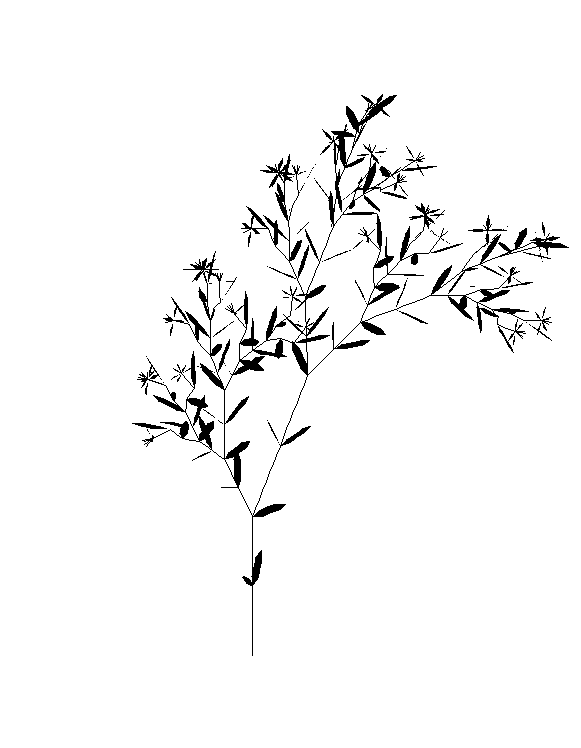

# Lindenmayer Systems (L-Systems) - University Project

## Description
This university project explores **Lindenmayer Systems (L-Systems)**, a mathematical model primarily used to simulate plant growth and fractal structures.

## Example Usage

Here is a simple example of an L-System representing a 3D flower:

## Authors

Wester
