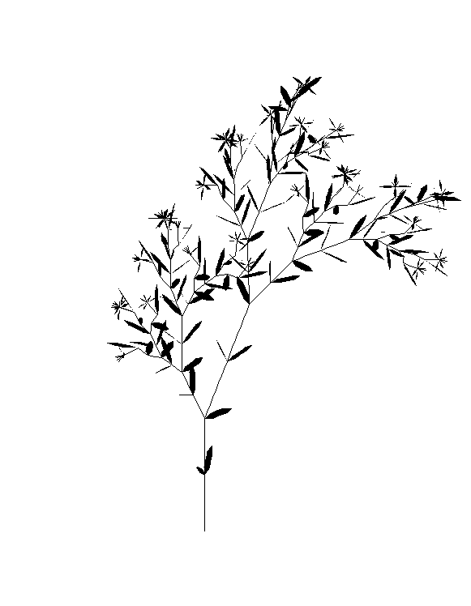

# L-Systems

A Java desktop L-system interpreter developed during my second year at the University of Caen. It expands rewriting rules from an axiom and displays the result with 2D or 3D turtle graphics in a Swing interface.

## Run

A prebuilt `L-Systems.jar` is included at the repository root. With Java installed and a graphical desktop available:

```sh
java -jar L-Systems.jar
```

An optional numeric argument selects one of the seven built-in presets. For example, index `4` opens the 3D plant:

```sh
java -jar L-Systems.jar 4
```

Preset indices are zero-based, from `0` to `6`.

## Build from source

Install a JDK providing `javac`, `jar` and `java`. No external Java dependencies or build tool are used.

From the repository root:

```sh
cd Lindenmayer
bash launch.sh
```

The script compiles `src/main/MainClass.java` and its dependencies into `Lindenmayer/build/`, rebuilds `L-Systems.jar` at the repository root, and launches the application. It also accepts the optional preset index:

```sh
bash launch.sh 4
```

## Use the interface

Choose a preset, or edit the axiom and rules. The controls set the generation count (`n`), segment length (`l`) and rotation angle (`δ`). Click **Draw** after editing the grammar.

The interpreter includes deterministic, stochastic and context-sensitive rule implementations. Rule formats are demonstrated in the built-in presets in [Fractals.java](Lindenmayer/src/system/Fractals.java).

For a simple branching plant, set the axiom to `F`, the angle to `22.5` and enter this rule:

```text
F: FF-[-F+F+F]+[+F-F-F]
```

The viewer selects the 2D or 3D turtle from the grammar. The 3D view rotates automatically. Its projection and drawing are implemented in Java with AWT/Swing.

## Example



## Code layout

- `Lindenmayer/src/main/`: application entry point, Swing window, controls and drawing panel.
- `Lindenmayer/src/system/`: rewriting, presets and rule construction.
- `Lindenmayer/src/system/rules/`: deterministic, stochastic and context-sensitive rules.
- `Lindenmayer/src/turtle/`: 2D and 3D turtle interpreters.
- `Lindenmayer/src/turtle/space/`: positions, stacks and spatial transformations.

The repository also includes the reference document [abop.pdf](abop.pdf).

## Author and license

Mathis Dubuisson (Wester).

See [LICENSE](LICENSE) for the GPLv3 license text.
